# MaGIC One Parcel (Web Application)
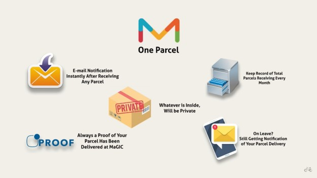

**Important links**
- Install Laravel Framework: [https://laravel.com/docs/6.x](https://laravel.com/docs/6.x)
- Install Composer: [https://getcomposer.org/download/](https://getcomposer.org/download/)
- Install XAMPP: [https://www.apachefriends.org/download.html](https://www.apachefriends.org/download.html)
- Demo Video : [https://www.youtube.com/watch?v=5243rLQBNy0&amp;feature=youtu.be](https://www.youtube.com/watch?v=5243rLQBNy0&amp;feature=youtu.be)

## **Installation in Windows**

• Install Composer in &#39;Developer Mode&#39;.

• The default path of your &#39;php.exe&#39; will be C:\xampp\php

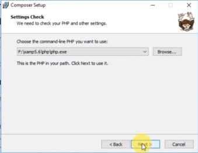

• Open your command prompt type &#39;composer&#39; and hit enter

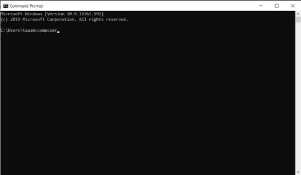

• Go to the directory where you want to install your project

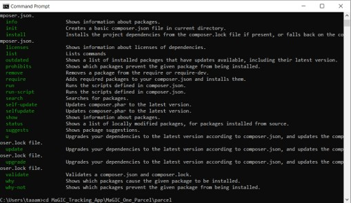

• type composer create-project --prefer-dist laravel/laravel parcel &quot;5.4.\*&quot;
(parcel is the project&#39;s name). It will take time to create the template project

• Download or clone the project from given link

• Replace everything from the template project you have created with the downloaded project

• Type &#39;composer install&#39; and press enter

• Type &#39;copy .env.example .env&#39; and press enter

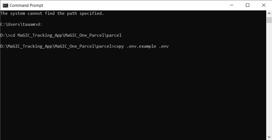

• Open the .env file with any text editor

• As I am using GMAIL STP so I put my gmail account and password on it

• Open XAMPP and start Apache &amp; MySQL

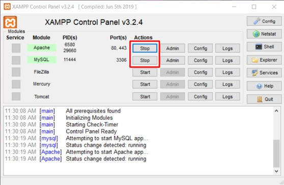

• Create a database and name is parcel\_service

• go inside &#39;parcel\_service&#39;, go to import, choose file (x:parcel\database\parcel\_service.sql) and press GO!

• Run &#39;php artisan key:generate&#39;

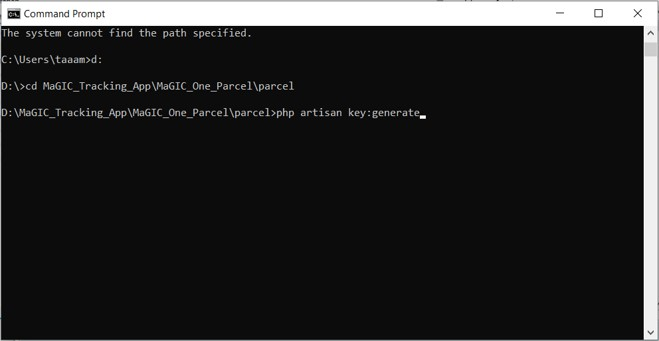

• Run &#39;php artisan migrate&#39;

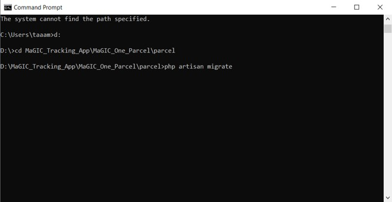

• Run &#39;php artisan serve&#39; and go to the url

• Use default email and password to login to the admin panel

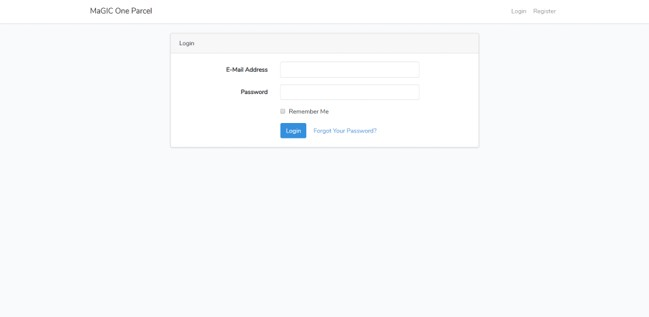

• On staffs tab it will be easy to add, edit and delete new staff

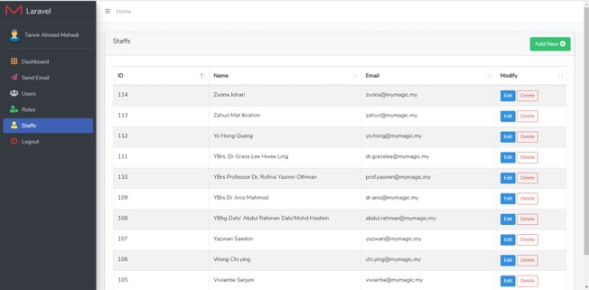

• On Users tab it will be easy to add and delete new Admin

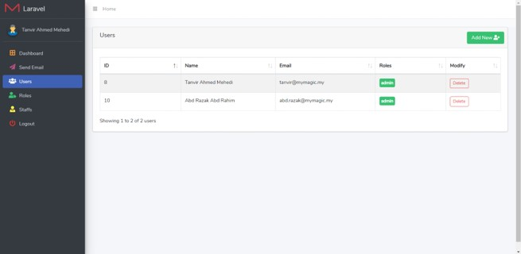

• On Send Email tab, user can choose the person&#39;s name, scan the tracking number and send an email.

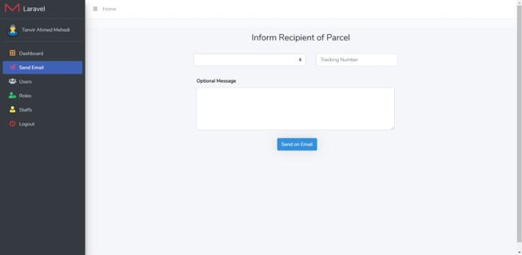

• The email will be coming like this

## **License**

Do not you for commercial reasons.
